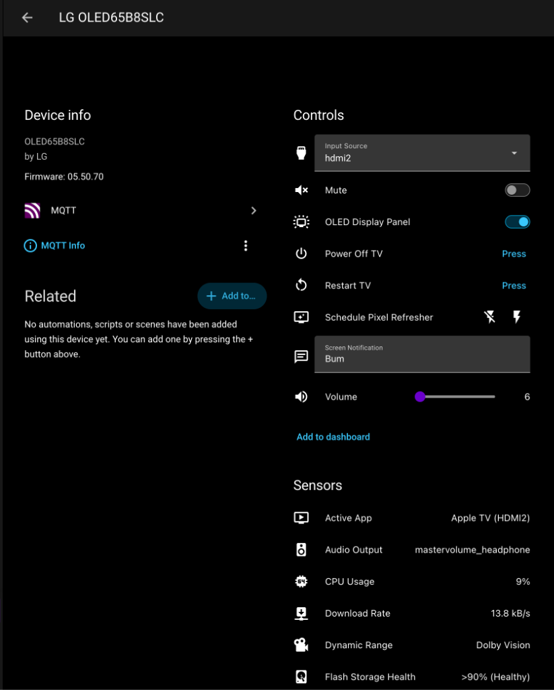

# lg-webos-mqtt · LG webOS Dashboard & Home Assistant Integration

<p align="center">
  
  
  
  
  
</p>

A lightweight, zero-dependency on-TV telemetry server, standalone mobile-friendly web dashboard, and Home Assistant MQTT Auto-Discovery integration for rooted LG webOS Smart TVs.

Runs natively in pure ES5 on the TV's embedded Node.js runtime, exposing **33 real-time entities** including OLED panel health, compensation cycle countdowns, Dolby Vision/HDR detection, audio routing, screen blanking for music, and local controls.

---

## Web Dashboard & Home Assistant Integration

### Local Controls

Controls lead the page, since that is usually why you opened it. Volume, OLED
panel blanking, source switching and power, driven straight over the Luna bus
with no cloud round-trip.

<p align="center">
  
</p>

### Metrics

Typography-led and monochrome, with colour reserved for meaning: the
temperature reading warms through its range, headroom bars run green to amber
to red, and Dolby Vision is picked out where it appears. Body text meets WCAG
AA contrast (4.5:1) on black.

<p align="center">
  
</p>

### Home Assistant &mdash; Auto-Discovered Device

All 33 entities arrive over MQTT Discovery as a single device, with no YAML to
write.

<p align="center">
  
</p>

---

## Key Highlights

### 🔬 OLED Panel Health & Lifespan Intelligence
- **Cumulative Panel Runtime (`sensor.lg_tv_oled_panel_hours`)**: Real-time cumulative panel operating hours reported directly by the display controller (`panelUsageTime`).
- **Short Compensation Cycle Tracking (`sensor.lg_tv_oled_hours_since_compensation`, `sensor.lg_tv_oled_hours_until_compensation`)**: Monitors hours elapsed since the last 4-hour Off-RS compensation cycle and estimates when the next one will run on standby.
- **Deep 1-Hour Pixel Refresher (`sensor.lg_tv_oled_hours_since_refresher`, `sensor.lg_tv_oled_hours_until_refresher`)**: Tracks cumulative hours since the factory 2,000-hour deep Pixel Refresher ("JB / Panel Wash") and estimates hours remaining until the next scheduled maintenance.
- **Pixel Refresher Scheduling (`switch.lg_tv_pixel_refresher_schedule`, `sensor.lg_tv_oled_refresher_status`)**: View refresher status (`Idle` vs. `Scheduled`) and remotely schedule or cancel a 1-hour calibration for the next power-off directly from Home Assistant or the web UI.
- **Burn-In Protection Status (`sensor.lg_tv_oled_screen_shift`, `sensor.lg_tv_oled_logo_dimming`)**: Live telemetry of Screen Shift (pixel orbiting) and Logo Luminance Adjustment.

### 🎵 Screen Blanking for Music Playback
- **OLED Panel Blanking Switch (`switch.lg_tv_display_panel`)**: Turn off the OLED screen while audio/music continues playing (`turnOffScreen`). Perfect for listening to Spotify, Tidal, Apple Music, or AirPlay without risking OLED burn-in or wasting panel hours.

### 🎬 Deep Video & Audio Observability
- **Dynamic Range (`sensor.lg_tv_dynamic_range`)**: Real-time detection of **Dolby Vision**, **HDR**, or **SDR**.
- **Picture Profile (`sensor.lg_tv_picture_mode`)**: Current profile (e.g. *Dolby Vision Cinema*, *ISF Expert Dark Room*, *Game*).
- **OLED Light (`sensor.lg_tv_oled_light`)**: Live panel backlight brightness level (`0–100%`).
- **HDMI Video Signal (`sensor.lg_tv_video_signal`)**: Raw resolution and refresh rate directly from HDMI status (e.g. `3840x2160 @ 60Hz`).
- **Audio Output Routing (`sensor.lg_tv_audio_output`)**: Active audio scenario (e.g. *Optical / Headphone*, *Internal TV Speaker*, *HDMI ARC*).
- **Active App & Friendly CEC Names (`sensor.lg_tv_active_app`)**: Resolves HDMI ports to friendly labels (e.g. `Apple TV (HDMI2)`, `Xbox (HDMI1)`).

### 🖥️ Hardware Diagnostics & Resource Monitoring
- **SoC Temperature (`sensor.lg_tv_soc_temperature`)**: Processor temperature (`°C`) with native graph history.
- **CPU & Core Load (`sensor.lg_tv_cpu_usage`)**: Overall CPU usage (`%`) and individual core breakdowns.
- **Memory & Swap Utilization (`sensor.lg_tv_memory_usage`, `sensor.lg_tv_swap_usage`)**: System RAM and zram swap metrics.
- **SoC Current Draw (`sensor.lg_tv_soc_current`)**: Total processor current draw (`mA`, CPU + Core AVS rails).
- **Wi-Fi Signal Strength (`sensor.lg_tv_wifi_signal`)**: Live RSSI signal strength (`dBm`).
- **Network Throughput (`sensor.lg_tv_download_rate`, `sensor.lg_tv_upload_rate`)**: Real-time bandwidth tracking (`kB/s`).
- **Flash Storage Health & Wear (`sensor.lg_tv_flash_health`, `sensor.lg_tv_flash_wear`)**: eMMC lifespan tracking with JEDEC health translation.

### 🎮 Bi-Directional Local Control
- **Volume & Mute**: Slider (`number.lg_tv_volume`) and toggle (`switch.lg_tv_mute`).
- **Input Switching**: Selector (`select.lg_tv_input_source`: HDMI 1–4, Live TV).
- **On-Screen Notifications**: Text field (`text.lg_tv_screen_notification`) sends instant toast messages to the TV screen.
- **System Power**: Soft restart and power-off buttons (`button.lg_tv_restart`, `button.lg_tv_power_off`).

---

## Architecture & Stability

```
                  ┌─────────────────────────────────────────┐
                  │          LG webOS TV (Rooted)           │
                  │              (Node 0.12)                │
                  │  ┌───────────────────┐ ┌─────────────┐  │
                  │  │ HTTP Dashboard UI │ │  MiniMQTT   │  │
                  │  │ (Port 8080)       │ │  Client     │  │
                  │  └─────────┬─────────┘ └──────┬──────┘  │
                  │            │                  │         │
                  │            ▼                  ▼         │
                  │   In-Flight Concurrency Mutex & Caching │
                  │            │                  │         │
                  │            ▼                  ▼         │
                  │   Direct execFile (luna-send -w 2000)   │
                  │      webOS Luna Bus & /proc telemetry   │
                  └───────────────────────────────┬─────────┘
                                                  │
                                    MQTT TCP 1883 │ (Telemetry + Controls)
                                                  ▼
                  ┌─────────────────────────────────────────┐
                  │          MQTT Broker / Mosquitto        │
                  └───────────────────────┬─────────────────┘
                                          │
                                          ▼
                  ┌─────────────────────────────────────────┐
                  │              Home Assistant             │
                  │         (33 Auto-Discovered Entities)   │
                  └─────────────────────────────────────────┘
```

### High-Stability Process Execution
Older Linux kernels and Node 0.12 can encounter process deadlocks or child leaks when `child_process.exec()` is called frequently (spawning `/bin/sh` without timeout parameters). 

`tvweb.js` solves this with:
1. **Direct `execFile`**: Invokes `/usr/bin/luna-send` directly with zero shell overhead.
2. **Internal Daemon Timeout**: Luna calls use `-w 2000` to prevent orphaned background processes if a system bus stalls.
3. **In-Flight Concurrency Mutex**: If multiple HTTP pollers or MQTT intervals request stats simultaneously, they are coalesced into a single execution pipeline.
4. **Memory Caching**: Telemetry is cached for 1.5 seconds, delivering sub-20ms HTTP responses with zero subprocess spawning during rapid UI updates.
5. **Deterministic MQTT Client Session**: Uses a static client ID and periodic availability reaffirmation so TV reboots or network reconnects never leave entities trapped in an "Unavailable" state.

---

## Quick Start

### 1. Prerequisites
- Rooted LG webOS TV with [webosbrew (Homebrew Channel)](https://github.com/webosbrew/webos-homebrew-channel) installed.
- Root Telnet enabled on port 23 (standard on rooted webOS devices).
- (Optional) An MQTT broker (e.g. Mosquitto in Home Assistant) reachable on your LAN.

### 2. Configuration
Copy `config.example.json` to `server/config.json` and configure your MQTT broker:

```bash
cp config.example.json server/config.json
```

```json
{
  "port": 8080,
  "host": "0.0.0.0",
  "allowControl": true,
  "allowPower": true,
  "token": "",
  "mqtt": {
    "enabled": true,
    "host": "192.168.1.125",
    "port": 1883,
    "username": "",
    "password": "",
    "topicPrefix": "lgtv",
    "discoveryPrefix": "homeassistant",
    "telemetryIntervalMs": 10000
  },
  "device": {
    "id": "lg_tv",
    "name": "",
    "model": "",
    "manufacturer": "LG"
  }
}
```

> **Tip:** If `name` or `model` are left empty, `tvweb.js` automatically queries the TV's system property service to detect your exact model number (e.g. `OLED65B8SLC`, `OLED55C1PUB`, etc.) and firmware version at runtime!

### 3. Deploy to TV
Deploy `tvweb.js` and install the persistent boot hook so it survives TV reboots:

```bash
cd server
./deploy.sh <tv-ip> --persist
```

The script will:
1. Temporarily serve the files from your computer and download them onto the TV (`/var/lib/tvweb/`).
2. Start `tvweb.js` under `setsid`.
3. If `--persist` is specified, install `/var/lib/webosbrew/init.d/50-tvweb`.
4. Clean up temporary transfer servers.

Open `http://<tv-ip>:8080/` in your browser to view the live dashboard.

---

## Home Assistant Entities

Once connected to your MQTT broker, Home Assistant automatically discovers **33 native entities** under a single unified device:

| Domain | Entity ID | Name | Description |
| :--- | :--- | :--- | :--- |
| `switch` | `switch.lg_tv_display_panel` | OLED Display Panel | Blanks/turns off OLED panel while audio plays |
| `switch` | `switch.lg_tv_mute` | Mute | Toggle audio mute |
| `switch` | `switch.lg_tv_pixel_refresher_schedule` | Schedule Pixel Refresher | Schedule/cancel 1-hour calibration for next standby |
| `number` | `number.lg_tv_volume` | Volume | Volume slider (0–100) |
| `select` | `select.lg_tv_input_source` | Input Source | HDMI 1–4, Live TV |
| `text` | `text.lg_tv_screen_notification` | Screen Notification | Send custom toast messages to TV screen |
| `button` | `button.lg_tv_restart` | Restart TV | Reboots the TV (requires `allowPower: true`) |
| `button` | `button.lg_tv_power_off` | Power Off TV | Powers off the TV (requires `allowPower: true`) |
| `sensor` | `sensor.lg_tv_oled_panel_hours` | OLED Panel Hours | Total cumulative operating hours (`h`) |
| `sensor` | `sensor.lg_tv_oled_hours_since_compensation` | OLED Hours Since Short Cycle | Hours elapsed since last 4h compensation (`h`) |
| `sensor` | `sensor.lg_tv_oled_hours_until_compensation` | OLED Hours Until Short Cycle | Hours until next short compensation due (`h`) |
| `sensor` | `sensor.lg_tv_oled_hours_since_refresher` | OLED Hours Since Pixel Refresher | Hours elapsed since last 2,000h deep refresher (`h`) |
| `sensor` | `sensor.lg_tv_oled_hours_until_refresher` | OLED Hours Until Pixel Refresher | Hours until next 2,000h deep refresher due (`h`) |
| `sensor` | `sensor.lg_tv_oled_refresher_status` | Pixel Refresher Status | `Idle` or `Scheduled` |
| `sensor` | `sensor.lg_tv_oled_screen_shift` | OLED Screen Shift | Pixel orbiting state (`ON` / `OFF`) |
| `sensor` | `sensor.lg_tv_oled_logo_dimming` | OLED Logo Dimming | Logo luminance reduction (`Low`, `Strong`, `Off`) |
| `sensor` | `sensor.lg_tv_dynamic_range` | Dynamic Range | **Dolby Vision**, **HDR**, or **SDR** |
| `sensor` | `sensor.lg_tv_picture_mode` | Picture Mode | Current profile (e.g. *Dolby Vision Cinema*) |
| `sensor` | `sensor.lg_tv_oled_light` | OLED Light | OLED panel backlight level (`0–100%`) |
| `sensor` | `sensor.lg_tv_video_signal` | Video Signal | HDMI resolution & refresh rate (e.g. `3840x2160 @ 60Hz`) |
| `sensor` | `sensor.lg_tv_audio_output` | Audio Output | Audio scenario (e.g. *Optical / Headphone*, *Internal*) |
| `sensor` | `sensor.lg_tv_active_app` | Active App | Current foreground app or friendly CEC device |
| `sensor` | `sensor.lg_tv_soc_temperature` | SoC Temperature | TV processor temperature (`°C`) |
| `sensor` | `sensor.lg_tv_soc_current` | SoC Current | Processor current draw (`mA`, CPU + Core AVS) |
| `sensor` | `sensor.lg_tv_cpu_usage` | CPU Usage | Real-time CPU load (`%`) |
| `sensor` | `sensor.lg_tv_memory_usage` | Memory Usage | System RAM usage (`%`) |
| `sensor` | `sensor.lg_tv_swap_usage` | Swap Usage | zram Swap usage (`%`) |
| `sensor` | `sensor.lg_tv_wifi_signal` | Wi-Fi Signal | Wi-Fi signal strength (`dBm`) |
| `sensor` | `sensor.lg_tv_download_rate` | Download Rate | Live network throughput (`kB/s`) |
| `sensor` | `sensor.lg_tv_upload_rate` | Upload Rate | Live network upload throughput (`kB/s`) |
| `sensor` | `sensor.lg_tv_flash_health` | Flash Storage Health | eMMC remaining health estimate (`>90% (Healthy)`) |
| `sensor` | `sensor.lg_tv_flash_wear` | Flash Wear Level | JEDEC write-cycle consumption (`0–10%`) |
| `sensor` | `sensor.lg_tv_uptime` | Uptime | TV uptime in seconds |

---

## Home Assistant Automations

### 1. Automatically Blank Screen When Playing Music (Spotify / AirPlay)
Save OLED panel hours and eliminate burn-in risk when streaming audio:

```yaml
alias: "TV: Turn Off Screen for Music"
trigger:
  - platform: state
    entity_id: sensor.lg_tv_active_app
    to: "spotify"
    for:
      seconds: 30
condition:
  - condition: state
    entity_id: switch.lg_tv_display_panel
    state: "on"
action:
  - service: switch.turn_off
    target:
      entity_id: switch.lg_tv_display_panel
```

### 2. Dim Cinema Lighting on Dolby Vision Playback
Trigger an ambient lighting scene whenever 4K Dolby Vision playback begins:

```yaml
alias: "Cinema: Dim Lights on Dolby Vision"
trigger:
  - platform: state
    entity_id: sensor.lg_tv_dynamic_range
    to: "Dolby Vision"
action:
  - service: scene.turn_on
    target:
      entity_id: scene.movie_night
```

### 3. Display Doorbell / Security Toast on TV Screen
Display a notification directly on the TV when a doorbell rings:

```yaml
alias: "Notify TV on Doorbell"
trigger:
  - platform: state
    entity_id: binary_sensor.front_doorbell_motion
    to: "on"
action:
  - service: text.set_value
    target:
      entity_id: text.lg_tv_screen_notification
    data:
      value: "Motion detected at front door"
```

---

## eMMC Flash Storage: Health vs. Wear

Under the **JEDEC eMMC 5.0** specification, `/sys/block/mmcblk0/device/life_time` returns byte estimates for SLC and MLC partition write cycles:
- `0x01` indicates **0% – 10% of rated device write cycles used**.
- This means **>90% of drive life remains** (Healthy).
- `pre_eol_info` returning `01` indicates normal endurance (<80% reserved blocks consumed).

To prevent user confusion, `tvweb.js` translates this into both a human-friendly health state (`>90% (Healthy)`) and a wear estimate (`0-10% used · Normal EOL`).

---

## ⚠️ Disclaimer & Safety

**Use this software at your own risk.**

- **Root Access & Hardware**: This project runs custom software with `root` privileges on an embedded Smart TV operating system. While designed to be lightweight, read-only to rootfs, and non-destructive, the authors and contributors assume **no responsibility or liability** for any damage, bootloops, bricked devices, voided warranties, data loss, OLED panel issues, or unexpected behavior resulting from the use or misuse of this software.
- **Power & Control Commands**: Features such as rebooting, power off, screen blanking, and Pixel Refresher scheduling issue low-level commands directly to webOS system services (`luna-send`). Ensure you understand what each command does before executing it.
- **Trademark Notice**: This is an independent, unofficial open-source community project. It is not affiliated with, endorsed by, or associated with LG Electronics Inc. in any way. webOS is a trademark of LG Electronics.

---

## Uninstallation

To completely remove the service and boot hook from the TV:

```bash
# Connect via telnet
nc <tv-ip> 23

# Inside TV shell:
pkill -9 -f tvweb.js
rm -rf /var/lib/tvweb
rm -f /var/lib/webosbrew/init.d/50-tvweb*
exit
```

Nothing on the TV's read-only rootfs is ever modified.

---

## Technical Notes

- **Node.js v0.12 (2015)**: webOS 4.x ships Node v0.12.2. All code in `tvweb.js` is written in strict ES5 (no `let`/`const`, no arrow functions, no template literals, no `async`/`await`).
- **BusyBox `run-parts` Hook Naming**: The webosbrew startup system invokes user hooks with `run-parts /var/lib/webosbrew/init.d`. BusyBox `run-parts` strictly ignores any filename containing a dot (`.`), so the boot hook must be named `50-tvweb` without `.sh`.
- **Luna Bus Introspection**: Control commands interact with webOS via native `luna-send` calls (`com.webos.audio`, `com.webos.service.tvpower`, `com.webos.applicationManager`, `com.webos.notification`, `com.webos.service.settings`, `com.webos.service.eim`).

---

## License

MIT License. See [LICENSE](LICENSE) for details.
