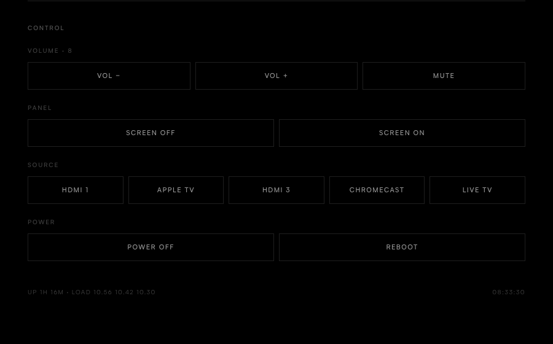

# LG webOS TV Dashboard & Home Assistant Bridge

A telemetry server that runs **on** a rooted LG webOS TV. It serves a live
dashboard to any browser on your network, and bridges the TV into Home
Assistant over MQTT as a single auto-discovered device with 33 entities.

Zero dependencies, zero install step: pure ES5 on the Node 0.12 runtime the TV
already ships.

---

### Local Controls

Volume, OLED panel blanking, source switching and power.

<p align="center">
  
</p>

### Metrics

<p align="center">
  
</p>

### Home Assistant &mdash; Auto-Discovered Device

All 33 entities arrive over MQTT Discovery as a single device, with no YAML to
write.
<p align="center">

</p>

### Privacy Panel

Behind a toggle in the controls, or at `/?privacy=1`. Reports live state from
the TV rather than repeating a settings menu: whether LG's content recognition
engine is running and sampling frames, your advertising identifier, and every
agreement recorded on the set. Off is shown as the private setting, so a green
column means what you would hope.

<p align="center">
  
</p>

---

## What it's for


1. **Controlling the TV without the cloud.** Volume, mute, input switching,
   on-screen toast messages, power and reboot &mdash; all local Luna calls.

2. **Seeing what the TV is actually doing.** SoC temperature, per-core CPU
   load, memory, swap, current draw, Wi-Fi signal and throughput &mdash; none of
   which webOS surfaces anywhere in its own UI.

3. **Watching OLED panel wear.** Cumulative panel hours, where you are in the
   4-hour compensation cycle, and how far off the 2,000-hour Pixel Refresher is.
   You can schedule or cancel a refresher for the next power-off.

4. **Seeing what LG collects.** Whether the content-recognition engine is
   actually running and sampling your screen, your advertising identifier, and
   every data-collection agreement recorded on the set &mdash; in plain English
   rather than acronyms.

## Core features

* **OLED panel health.** Panel hours, compensation cycle, Pixel Refresher
  countdown and scheduling, screen shift and logo dimming state. Automatically
  hidden on LCD/QNED sets, which have no such counters.
* **Video and audio observability.** Dolby Vision / HDR / SDR detection, picture
  mode, OLED light level, raw HDMI signal (`3840x2160 @ 60Hz`), audio output
  routing, and active app with friendly input names (`Apple TV (HDMI2)`).
* **Hardware diagnostics.** SoC temperature and current draw, CPU and per-core
  load, memory and zram swap, Wi-Fi RSSI, network throughput, and eMMC flash
  wear with JEDEC health translation.
* **Bi-directional control.** Volume, mute, input select, screen blanking,
  on-screen notifications, power and restart &mdash; from the dashboard or Home
  Assistant.
* **Privacy panel.** Behind a toggle in the controls: whether LG's screen
  content recognition is actually running and sampling frames, your advertising
  identifier and whether ad tracking is limited, every data-collection
  agreement recorded on the TV in plain English, and which of LG's collection
  services are alive. Includes buttons to reset the advertising ID and clear ad
  cookies, both of which are real platform calls rather than file edits.
  Reporting only &mdash; the agreements themselves have no API and are changed
  on the TV, under Settings &rarr; General &rarr; About This TV &rarr; User
  Agreements. Deep link: `/?privacy=1`.
* **Self-contained dashboard.** Fonts and assets are served by the TV, so the
  page works with no internet access.

## Requirements

* A rooted LG webOS TV ([Root tool here](https://github.com/throwaway96/dejavuln-autoroot/)) with the
  [Homebrew Channel](https://github.com/webosbrew/webos-homebrew-channel).
* An MQTT broker reachable on your LAN, if you want the Home Assistant side.
  The dashboard works without one.

### Tested on

Developed against a single set, so the compatibility picture is thin. The Luna
service names and `/proc/lg` paths this relies on may differ across webOS
versions and panel types.

| Model | webOS | Firmware | Panel | Status |
| :--- | :--- | :--- | :--- | :--- |
| OLED65B8SLC | 4.4.3 | 05.50.70 | OLED | Fully working |

**If you run it on anything else, please open an issue either way** &mdash;
working or not. Include your model, webOS version and
`/var/lib/tvweb/tvweb.log` and I will add a row. Reports from LCD/QNED sets are
especially useful: the panel-health features are meant to detect themselves as
unavailable there rather than report zeros, and that path has only been tested
with a simulated payload.

---

## 1. Access

`deploy.sh` needs a root shell on the TV. It uses **SSH** when key-based login
works and falls back to the Homebrew Channel's **telnet** otherwise, so you do
not have to change anything to get started.

* **Already using SSH keys with your TV?** Nothing to do &mdash; skip to step 2.
* **Freshly rooted, telnet only?** That works too. Skip to step 2.
* **Want to move to SSH?** Recommended, and it takes about five minutes:
  see [Moving from telnet to SSH](docs/SECURITY.md#moving-from-telnet-to-ssh).
  You can do it before or after installing; `deploy.sh` works either side.

Worth knowing whichever you choose: a rooted TV's telnet is an
**unauthenticated root shell on port 23** &mdash; anyone on your network gets
root with no password. That comes from the rooting rather than from this
project, but it is the largest exposure on the TV and worth closing when you
get the chance.

## 2. Configure

```bash
cp config.example.json server/config.json
```

Set your broker under `mqtt` and turn it on. Leaving `device.name` and
`device.model` empty makes the TV report its own model and firmware at runtime.

Both halves are independent, so run whichever you want:

| | `web.enabled` | `mqtt.enabled` |
| :--- | :--- | :--- |
| Dashboard and Home Assistant *(default)* | `true` | `true` |
| Dashboard only | `true` | `false` |
| Home Assistant only | `false` | `true` |

If you drive everything from Home Assistant, set `"web": { "enabled": false }`.
The dashboard is an unauthenticated control endpoint unless you set `token`, so
an MQTT-only install is better off without one. With both disabled the server
exits rather than idling.

`allowPower` ships disabled, because there is no authentication unless you set
`token` &mdash; a fresh install should not expose "turn the TV off" to the whole
network. Enable it deliberately.

Before pointing this at a broker that also drives your lights, read
[docs/SECURITY.md](docs/SECURITY.md): give the TV its own MQTT user with a
restricted ACL, rather than reusing your main Home Assistant credentials.

## 3. Install

```bash
cd server
./deploy.sh <tv-ip> --persist
```

`--persist` installs a boot hook so it survives reboots. The script copies over
SSH where available, falling back to telnet; `--telnet` forces the old path.

Then open **`http://<tv-ip>:8080/`**.

If you configured MQTT, Home Assistant discovers the device automatically &mdash;
no YAML. See [docs/HOME-ASSISTANT.md](docs/HOME-ASSISTANT.md) for the entity
list and example automations.

## Managing it

```bash
ssh root@<tv-ip> /var/lib/tvweb/tvwebctl status    # start | stop | restart | status
```

## Uninstalling

```bash
ssh root@<tv-ip>
/var/lib/tvweb/tvwebctl stop
rm -rf /var/lib/tvweb
rm -f /var/lib/webosbrew/init.d/50-tvweb*
```

Nothing on the TV's read-only rootfs is ever modified.

---

## Security

The dashboard has **no authentication by default** and binds to `0.0.0.0`, so
anyone who can reach the port can use every enabled control. On a home LAN that
is usually the point &mdash; but set `"token": "something-long"` in
`config.json` if you want it gated, and never port-forward it. If you only use
Home Assistant, `"web": { "enabled": false }` removes the endpoint entirely.

Setting a token affects the dashboard only. **Home Assistant is unaffected**,
since MQTT is a separate channel.

Full detail, including the MQTT ACL guidance and optional TLS, is in
[docs/SECURITY.md](docs/SECURITY.md).

## Documentation

* [docs/SECURITY.md](docs/SECURITY.md) &mdash; threat model, SSH migration, MQTT hardening
* [docs/HOME-ASSISTANT.md](docs/HOME-ASSISTANT.md) &mdash; all 33 entities, example automations
* [docs/IMPLEMENTATION.md](docs/IMPLEMENTATION.md) &mdash; architecture, `/proc/lg` reference, platform quirks

---

## Disclaimer

**Use this software at your own risk.**

- **Root access and hardware.** This runs custom software with `root`
  privileges on an embedded TV OS. It is designed to be lightweight and to
  leave the read-only rootfs untouched, but the authors accept **no
  responsibility** for damage, bootloops, bricked devices, voided warranties,
  data loss or OLED panel issues.
- **Power and control commands.** Reboot, power off, screen blanking and Pixel
  Refresher scheduling issue low-level `luna-send` calls. Understand what each
  does before using it.
- **Trademarks.** An independent, unofficial community project, not affiliated
  with or endorsed by LG Electronics. webOS is a trademark of LG Electronics.
- **Fonts.** Bundles [Outfit](https://github.com/Outfitio/Outfit-Fonts) and
  [Manrope](https://github.com/sharanda/manrope) under the
  [SIL Open Font License 1.1](https://openfontlicense.org/); licence texts ship
  in `server/assets/fonts/`.

## License

MIT. See [LICENSE](LICENSE).
