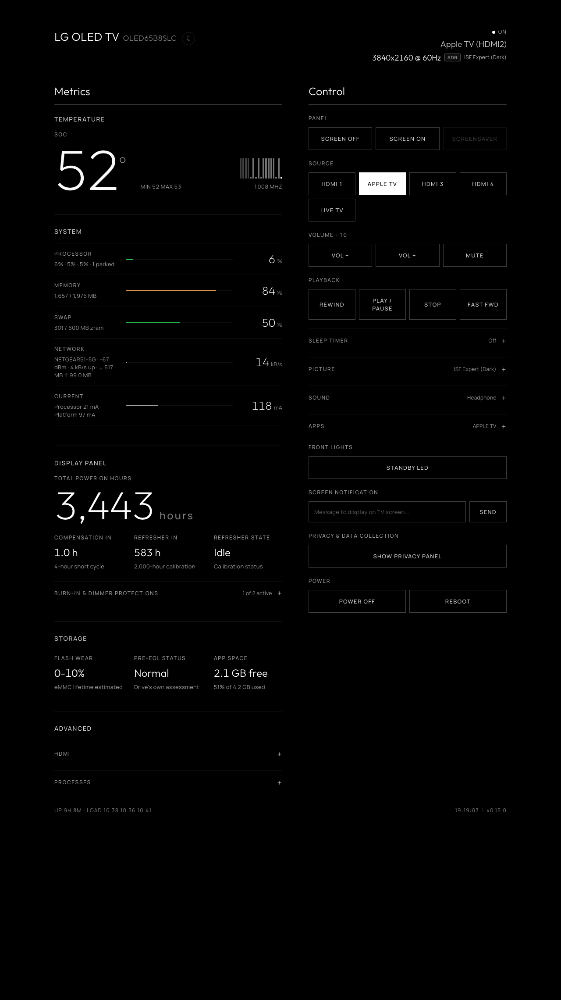
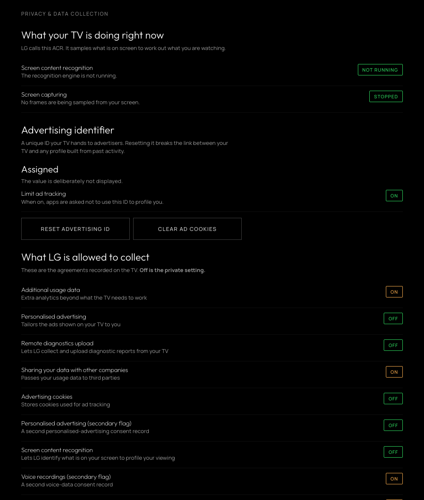

# LG webOS TV Dashboard & Home Assistant Bridge

A telemetry server that runs **on** a rooted LG webOS TV. It serves a live
dashboard to any browser on your network, and bridges the TV into Home
Assistant over MQTT as a single auto-discovered device with 48 entities.

There are no dependencies. This is ES5 on the Node 0.12 runtime that is on the TV.

> **Device & webOS Support:** Built and tested for rooted LG TVs running **webOS 3.4 up to webOS 24 (webOS 9+)**, covering 2016–2024+ models across OLED, QNED, NanoCell, and LCD (including B7, B8, C9, C1, C2, and G4). Telemetry, controls, and Home Assistant MQTT entities dynamically adapt to your set's capabilities. See [Tested on](#tested-on) for verified models.

---

### Web Dashboard & Controls

Live telemetry and full local control in a two-column layout. The masthead
shows whether the panel is actually lit, so a blanked screen does not read as
though something is playing.

<p align="center">
  
</p>

### Home Assistant (Auto-Discovered Device via MQTT)

All 48 entities arrive over MQTT Discovery as a single device
<p align="center">

</p>

### Privacy Panel & On-TV Ad Blocker

Behind a toggle in the controls, or at `/?privacy=1`. Reports live state from
the TV rather than repeating a settings menu: whether LG's content recognition
engine is running and sampling frames, your advertising identifier, and every
agreement recorded on the set. Includes an on-TV ad & telemetry sinkhole via
bind-mounting over `/etc/hosts` that persists across reboots.

<p align="center">
  
</p>

---

## What it's for


1. **Controlling the TV without the cloud.** Volume, mute, media playback keys (play, pause, stop, skip), app launcher, picture presets, sound output routing, power and reboot.

2. **Seeing what the TV is actually doing.** SoC temperature, per-core CPU
   load, memory, swap, current draw, Wi-Fi signal and throughput.

3. **Observing OLED panel wear.** Cumulative panel hours, where you are in the
   4-hour compensation cycle, and how far off the 2,000-hour Pixel Refresher is.
   You can schedule or cancel a refresher for the next power-off.

4. **Seeing what LG collects & blocking telemetry.** Whether the content-recognition
   engine is actually running and sampling your screen, your advertising identifier,
   data agreements, and an on-TV `/etc/hosts` blackhole for LG ad and telemetry domains.

## Core features

* **OLED panel health.** Panel hours, compensation cycle, Pixel Refresher
  countdown and scheduling, screen shift and logo dimming state. Automatically
  hidden on LCD/QNED sets, which have no such counters.
* **Video and audio observability.** Dolby Vision / HDR / SDR detection, picture
  mode, OLED light level, raw HDMI signal (`3840x2160 @ 60Hz`), audio output
  routing, and active app with friendly input names (`Apple TV (HDMI2)`).
* **Hardware diagnostics.** SoC temperature and current draw, CPU and per-core
  load, GPU clock, memory and swap, Wi-Fi RSSI, network throughput, eMMC
  flash wear with JEDEC health translation, and free space on the app partition.
* **Advanced panels.** HDMI link state per port straight off the receiver
  (resolution, refresh rate, colour depth, pixel clock) and a read-only list of
  what is resident in memory. Both load on demand.
* **Bi-directional control.** Volume, mute, input select, media playback (play/pause/stop/skip via native remote key injection), app launching, picture presets, sound outputs, screen blanking, sleep timer, standby LED, on-screen notifications, power and restart (from the dashboard or Home Assistant). The picture presets on offer are the ones the TV will accept for whatever is playing &mdash; a Dolby Vision source has its own set.
* **On-TV ad & telemetry sinkhole.** Sinkholes 15 known LG tracking, ad and ACR
  endpoints directly on the set by bind-mounting a local blackhole table over
  `/etc/hosts`. Automatically restored on boot. **Note that two of those domains
  are LG infrastructure, not pure ad hosts** &mdash; `ngfts.lge.com` (content and
  firmware delivery) and `lgtvsdp.com` (the service platform behind the LG Content
  Store) &mdash; so with the sinkhole on, firmware updates and the app store may
  stop working. That is the trade; turn it off if you need either.
* **Privacy panel.** Behind a toggle in the controls: whether LG's screen
  content recognition is actually running and sampling frames, your advertising
  identifier and whether ad tracking is limited, every data-collection
  agreement recorded on the TV, and which of LG's collection
  services are alive. Includes buttons to reset the advertising ID, clear ad
  cookies, and toggle the on-TV ad blocker. Deep link: `/?privacy=1`.
* **Self-contained dashboard.** Fonts and assets are served by the TV, so the
  page works with no internet access.

## Requirements

* A rooted LG webOS TV ([Root tool here](https://github.com/throwaway96/dejavuln-autoroot/)) with the
  [Homebrew Channel](https://github.com/webosbrew/webos-homebrew-channel).
* An MQTT broker reachable on your LAN, if you want the Home Assistant side.
  The dashboard works without one.

### Tested on

Tested across the following sets so far. The Luna
service names and `/proc/lg` paths this relies on may differ across webOS
versions and panel types.

| Model | webOS | Firmware | Panel | Notes |
| :--- | :--- | :--- | :--- | :--- |
| OLED65B8SLC | 4.4.3 | 05.50.70 | OLED | Development set |
| OLED65C9AUA | 4.9.x (4.5+) | 05.50.00 | OLED | |
| OLED55C1PUB | 6.x (6.3+) | 03.53.45 | OLED | SSH install and MQTT bridge confirmed |
| 55UH6030-UC | 3.4.3 | &mdash; | LCD | |
| OLED55G42LW | 24 | 33.31.68 | OLED | Rooted with slopbro, not the Homebrew Channel |
| OLED42C24LA | 9.2.2 (22+) | 23.25.55 | OLED | Rooted with jsbro-autoroot |
| OLED65B7V-Z | 3.9.3 | 06.10.65 | OLED | No SoC temperature or eMMC wear readings |

**If you run it on anything else, please open an issue whether it's working or not**
Include your model, webOS version and
`/var/lib/tvweb/tvweb.log` and I will add a row.

---

## 1. Access

`deploy.sh` needs a root shell on the TV. It uses **SSH** when key-based login
works and falls back to the Homebrew Channel's **telnet** otherwise, so you do
not have to change anything to get started.

* **Already using SSH keys with your TV?** Nothing to do. Skip to step 2.
* **Freshly rooted, telnet only?** That works too. Skip to step 2.
* **Want to move to SSH?** Recommended, and it takes about five minutes:
  see [Moving from telnet to SSH](docs/SECURITY.md#moving-from-telnet-to-ssh).
  You can do it before or after installing; `deploy.sh` works either side.

Worth knowing whichever you choose: a rooted TV's telnet is an
**unauthenticated root shell on port 23**. Anyone on your network gets
root with no password. That comes from the rooting rather than from this
project, but it is the largest exposure on the TV and worth closing when you
get the chance.

## 2. Configure

```bash
cp config.example.json server/config.json
```

Set your broker under `mqtt` and turn it on. Leaving `device.name` and
`device.model` empty makes the TV report its own model and firmware at runtime.
Panel hours, Pixel Refresher and Screen Shift appear on OLED sets only; add
`"panel": "lcd"` or `"panel": "oled"` if a set is read the wrong way.

Both halves are independent, so run whichever you want:

| | `web.enabled` | `mqtt.enabled` |
| :--- | :--- | :--- |
| Dashboard and Home Assistant *(default)* | `true` | `true` |
| Dashboard only | `true` | `false` |
| Home Assistant only | `false` | `true` |

If you drive everything from Home Assistant, set `"web": { "enabled": false }`.
The dashboard is an unauthenticated control endpoint unless you set `token`, so
an MQTT-only install is better off without one. With both disabled the server
exits rather than idling.

`allowPower` ships disabled, because there is no authentication unless you set
`token` &mdash; a fresh install should not expose "turn the TV off" to the whole
network. Enable it deliberately.

Recommended: Give the TV its own MQTT user with a
restricted ACL, rather than reusing your main Home Assistant credentials. See [docs/SECURITY.md](docs/SECURITY.md)

### Multiple TVs on the same network

If you run `tvweb` on more than one TV connecting to the same MQTT broker, each TV **must** have its own unique `topicPrefix` and `device.id`. If two TVs share the default (`lgtv` / `lg_tv`), they will overwrite each other's state topics and Home Assistant device registry, and repeatedly disconnect each other from the broker due to matching client IDs.

In each TV's `config.json` (or `server/config.<tv-ip>.json` on your computer before deploying):

```json
{
  "mqtt": {
    "topicPrefix": "lgtv_bedroom"
  },
  "device": {
    "id": "lg_bedroom_tv",
    "name": "LG Bedroom OLED"
  }
}
```

`deploy.sh` automatically checks for `server/config.<tv-ip>.json` first (e.g. `server/config.192.168.1.13.json`) before falling back to `server/config.json`, making multi-TV deployments straightforward.

## 3. Install

```bash
cd server
./deploy.sh <tv-ip> --persist
```

`--persist` installs a boot hook so it survives reboots. The script copies over
SSH where available, falling back to telnet; `--telnet` forces the old path. The
telnet path has to find this machine's LAN address to serve the files from; if
it cannot, pass it as `MYIP=192.168.x.y ./deploy.sh <tv-ip>`.

Then open **`http://<tv-ip>:8080/`**.

If you configured MQTT, Home Assistant discovers the device automatically &mdash;
no YAML. See [docs/HOME-ASSISTANT.md](docs/HOME-ASSISTANT.md) for the entity
list and example automations.

## Managing it

```bash
ssh root@<tv-ip> /var/lib/tvweb/tvwebctl status    # start | stop | restart | status
```

## Uninstalling

```bash
ssh root@<tv-ip>
/var/lib/tvweb/tvwebctl stop
rm -rf /var/lib/tvweb
rm -f /var/lib/webosbrew/init.d/50-tvweb*
```

Nothing on the TV's read-only rootfs is ever modified.

---

## Security

The dashboard has **no authentication by default** and binds to `0.0.0.0`, so
anyone who can reach the port can use every enabled control. On a home LAN that
is usually the point but you can set `"token": "something-long"` in
`config.json` if you want it gated, and never port-forward it. If you only use
Home Assistant, `"web": { "enabled": false }` removes the endpoint entirely.

Setting a token affects the dashboard only. **Home Assistant is unaffected**,
since MQTT is a separate channel.

Full detail, including the MQTT ACL guidance and optional TLS, is in
[docs/SECURITY.md](docs/SECURITY.md).

## Documentation

* [docs/SECURITY.md](docs/SECURITY.md) &mdash; threat model, SSH migration, MQTT hardening
* [docs/HOME-ASSISTANT.md](docs/HOME-ASSISTANT.md) &mdash; all 48 entities, universal media player, example automations
* [docs/IMPLEMENTATION.md](docs/IMPLEMENTATION.md) &mdash; architecture, `/proc/lg` reference, platform quirks

---

## Disclaimer

**Use this software at your own risk.**

- **Root access and hardware.** This runs custom software with `root`
  privileges on an embedded TV OS. It is designed to be lightweight and to
  leave the read-only rootfs untouched, but the authors accept **no
  responsibility** for damage, bootloops, bricked devices, voided warranties,
  data loss or OLED panel issues.
- **Power and control commands.** Reboot, power off, screen blanking and Pixel
  Refresher scheduling issue low-level `luna-send` calls. Understand what each
  does before using it.
- **Trademarks.** An independent, unofficial community project, not affiliated
  with or endorsed by LG Electronics. webOS is a trademark of LG Electronics.
- **Fonts.** Bundles [Outfit](https://github.com/Outfitio/Outfit-Fonts) and
  [Manrope](https://github.com/sharanda/manrope) under the
  [SIL Open Font License 1.1](https://openfontlicense.org/); licence texts ship
  in `server/assets/fonts/`.

## License

MIT. See [LICENSE](LICENSE).
